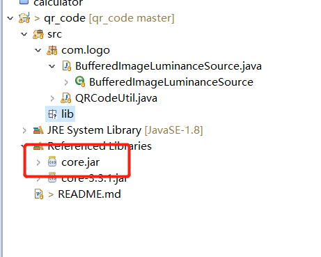
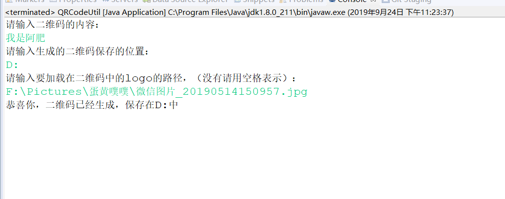

# 1. QR_Code
利用Java的输入输出流编写的一个生成二维码的程序
# 2. 环境
eclipse2.19+JavaSE1.8+core.jar
# 3. 使用到的框架
无
# 4. 使用指南
- 导入项目
- 需要导入lib文件下的core.jar包,否则会报错,右键 Add to Path

- 在控制台输入想要生成的二维码的内容，然后输入生成二维码的路径，还可以选择二维码中间的图标
回车即可以生成相应的二维码
# 5. 运行效果

下面是我f盘下的图片:

# 6. 注意事项
无
